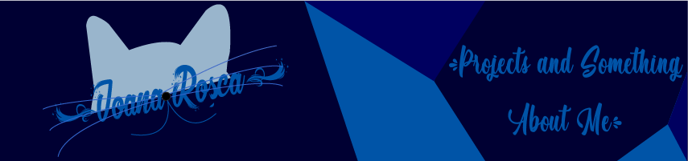

<h1 align="center">
 
</h1>

## About Me

Hi! My name is Ioana. I am a passionate soul, especially when it comes to software development and testing. I seek personal and professional growth. My vision for the future is to discover and learn of this wonderful tech world everyday, making connections with the people around me and from other cultures. The foundation of the way I live my life are my core values: respect, honesty, friendship, passion and determination.
Giving up was never an option for me!

## How To Reach Me & Personal Achievements

## 🔧Technologies & Tools

<!--  -->

## &#x1f4c8; GitHub Stats

<!--
**roscaioana11/roscaioana11** is a ✨ _special_ ✨ repository because its `README.md` (this file) appears on your GitHub profile.

Here are some ideas to get you started:

- 🔭 I’m currently working on ...
- 🌱 I’m currently learning ...
- 👯 I’m looking to collaborate on ...
- 🤔 I’m looking for help with ...
- 💬 Ask me about ...
- 📫 How to reach me: ...
- 😄 Pronouns: ...
- ⚡ Fun fact: ...
-->
